## Mobile App API Penetration Platform(MAAPP)

MAAPP is an Android/iOS App API penetration tool. Using it penetration tester can be more efficient as it ignores the implementation of various protection functions (e.g. encryption). Powered by [frida.re](https://www.frida.re), [python3](https://www.python.org)
Base on https://github.com/lyxhh/lxhToolHTTPDecrypt/, thanks @lyxhh a lot.

MAAPP support two modes:
- Mode 1:
Call decrypt/encrypt/hash functions directly through the burpsuite plugin.
- Mode 2(Recommand):
Modify plaintext data before eencryption/hash functions processing.  
How does mode 1 work?
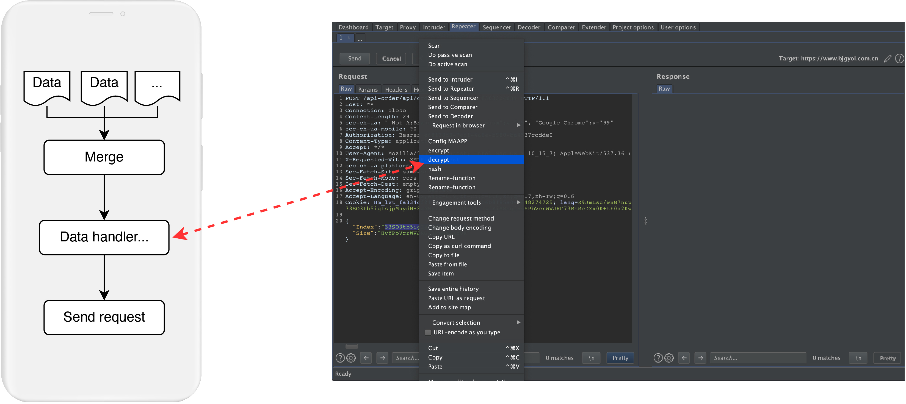
How does mode 2 work?
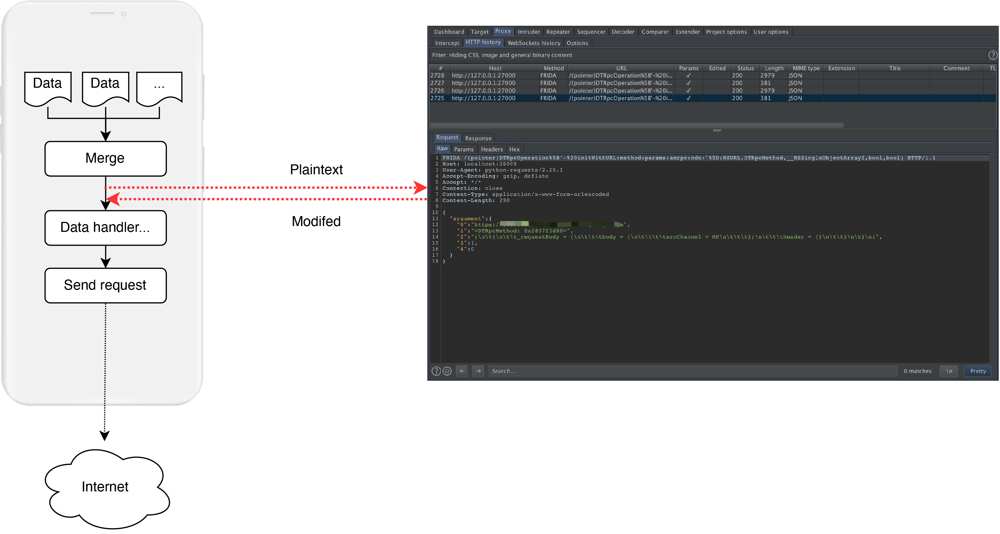

## Note:
Using this tool for penetration testing is not a zero threshold, because whether you choose mode 1 or mode 2 generally requires some reverse engineering, the workload of reverse engineering depends on the effect of "Trace" in the tool, It may not be necessary to open IDA Pro at all, maybe some simple reverse engineering is required.

## Features
- Cross plarform web GUI
- Hook all methods with the given class and print stack information
- Find all methods with the given class
- Find or hook the method based on the given string
- Hook any Java/ObjC methods 
- Print iOS app http(s) network request stack infomation
- Native functions can be called in burp to process request data
- Redirect network request data to burp, and support arbitrary modification

## Installation and setup
$ git clone https://github.com/Daemonceltics/MAAPP  
$ pip3 install -r requirements.txt    
Burp install extender(Only for mode 1):
Extender->Add->Select file->Select BurpPlugin.jar  
A mobile phone that frida installed connect to the PC

## Usage 
$ python3 app.py    
web server url is http://localhost:8088  (default)   
Open another terminal(It's unnecessary if you use mode one)  
$ python3 tracer.py  
Set up burpsuite:

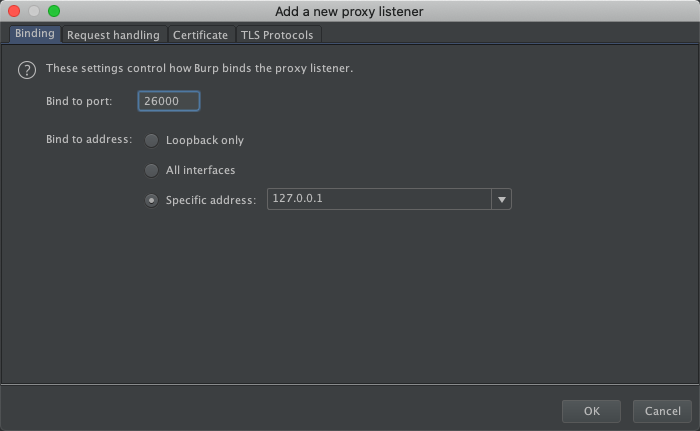
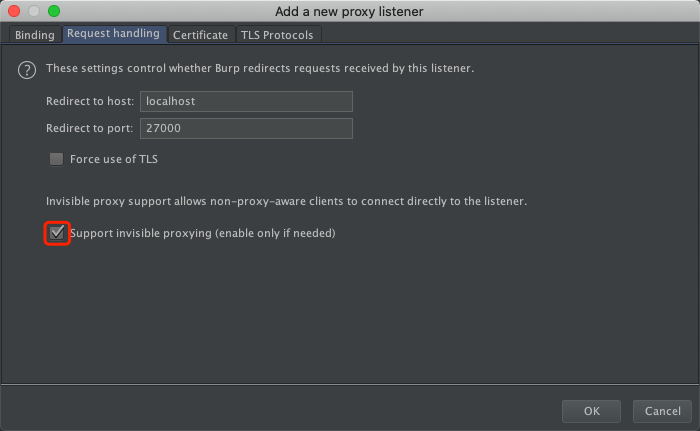  
And make sure no socks proxy be used:

Open http://localhost:8088 on your browser, click refresh PID button
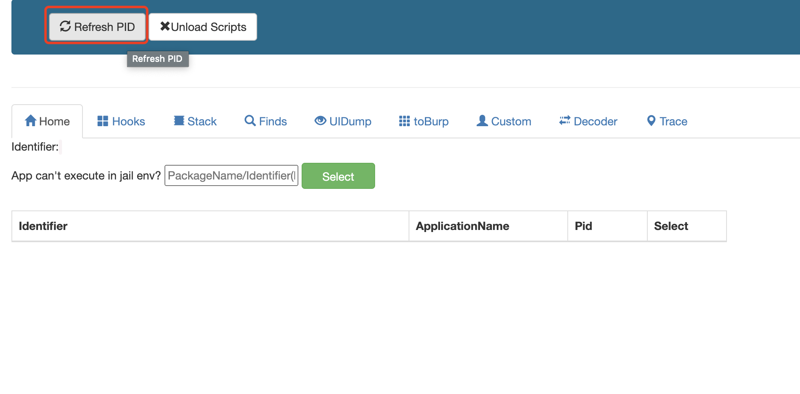
Select process you will hacked
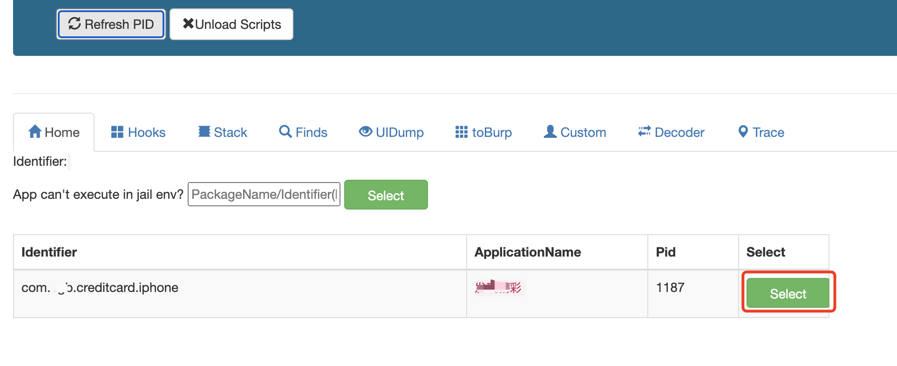
Then switch to Trace module(Currently only Android is supported) and start trace
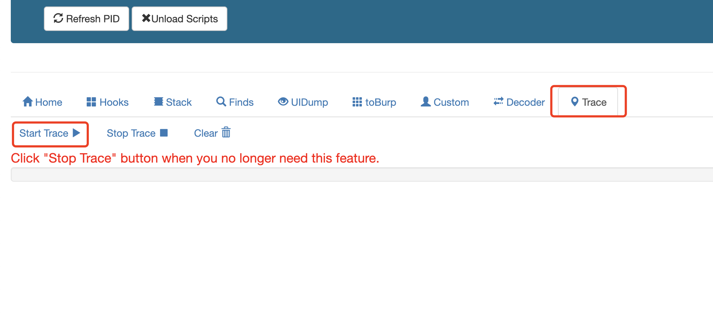
Operate the App to send network requests，If all goes well you will see a result similar to the figure below. It helps you find the entry point for network data processing quickly. Of course we only need to focus on the module of CFBundleName
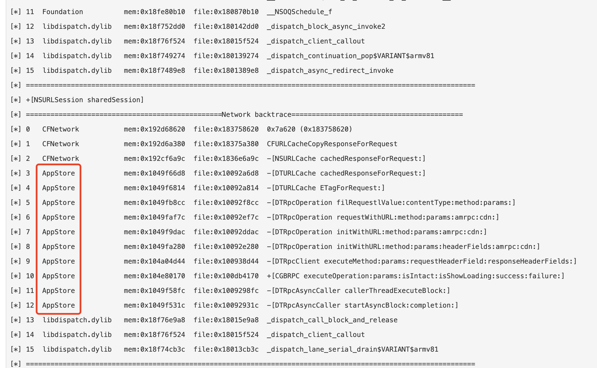
(The AppStore in the picture is not the system App Store, it just happens to have the same name)
According to ObjC's selector, we can know that the DTRpcOperation class is a part of the network communication data processing, so we can try to instrument the relevant class as the key function to forward data to burp. So switch toBurp menu, input DTRpcOperation and click the "Confim" button
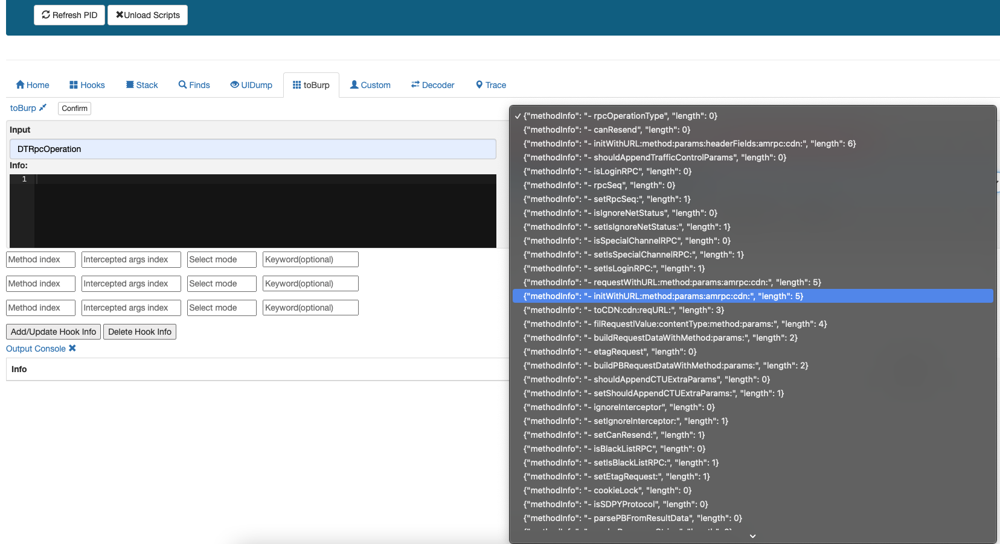
Select the target function and click "Add" button to add the function information to "Info", then configure index infomation
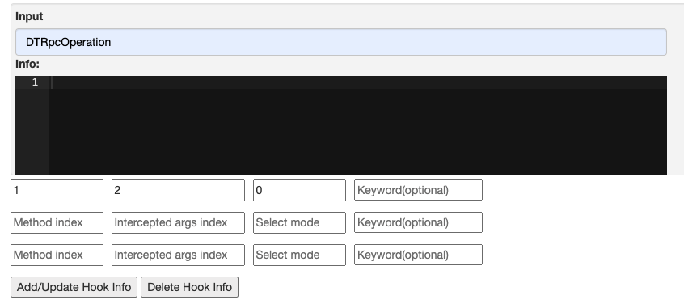
"Select mode" select 0 and "Keyword" leave it blank, click "Add/Update Hook Info", your burp will receive the parameters of the function mentioned above, and you can insert a pentesting payload on it
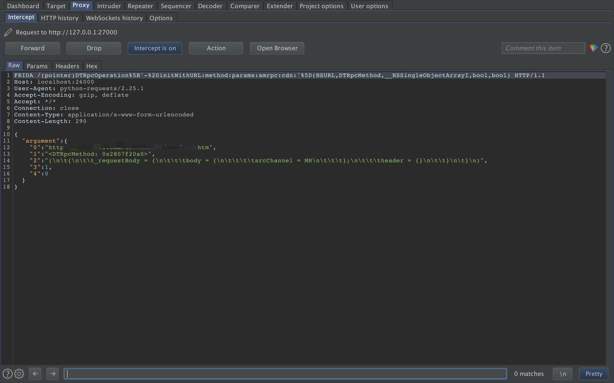
The data in the burp is complete and plaintext if you choose a "good" enough function.


## Known issues
1. Memory address hooking is not supported
2. Android platform has fewer parameter types, usage and testing than iOS platform, and the code may not be robust enough. Supported types of function parameters are:
```
Android:String, org.json.JSONObject, byte[]
iOS:NSString, NSDictionary, NSData, NSURL 
```
3. Repeater and Intruder features in burp are not supported

## LICENCE
MIT
